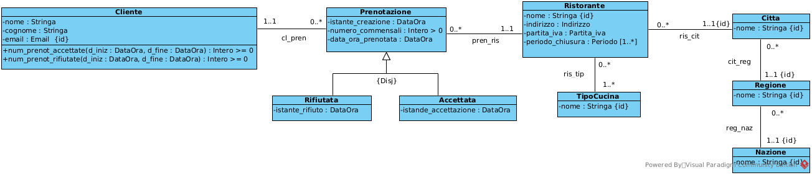
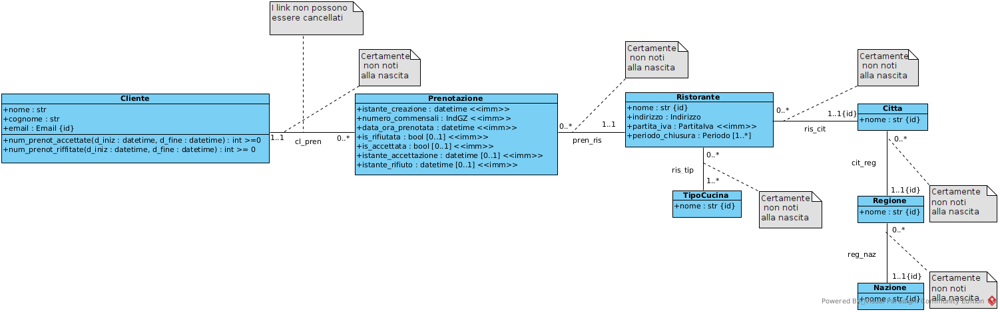
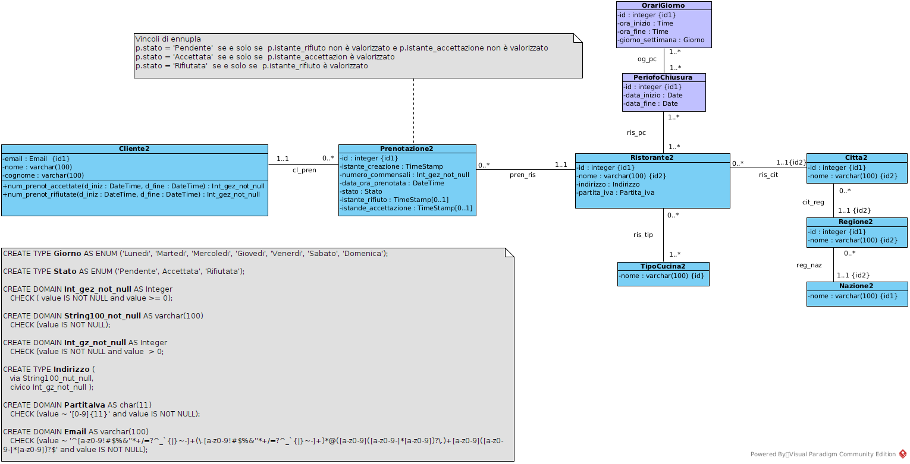

# RistoBook — Restaurant Booking System


RistoBook è un **sistema informativo per la gestione delle prenotazioni nei ristoranti**.

Il progetto mostra come un sistema progettato tramite **UML** possa essere tradotto in una **implementazione Python orientata agli oggetti** ed esposto tramite **API REST con Flask**.

---

# Project Context

Il progetto RistoBook nasce inizialmente come **progetto accademico di gruppo**, svolto durante un corso di progettazione di sistemi informativi.

Il lavoro di gruppo ha riguardato principalmente:

- analisi dei requisiti
- modellazione del dominio
- creazione dei diagrammi UML
- definizione delle specifiche funzionali

Il progetto originale è stato sviluppato da un team di **7 studenti**.

Questo repository **non contiene il lavoro completo del team**, ma utilizza alcuni diagrammi UML come riferimento per comprendere la struttura del sistema.

---

# Personal Implementation

Questo repository rappresenta **un lavoro personale sviluppato successivamente** con l’obiettivo di approfondire come un sistema progettato a livello concettuale possa essere implementato in Python.

In particolare ho voluto esplorare:

- come tradurre un **modello UML in codice Python**
- come implementare **classi di dominio e classi di associazione**
- come strutturare un **domain model complesso**
- come esporre il modello tramite **API REST con Flask**

L’implementazione Python presente in questo repository è stata **sviluppata interamente da me** come esercizio personale.

I diagrammi UML inclusi servono **solo come riferimento per comprendere il modello del sistema**.

Il focus principale del progetto è quindi il passaggio:

```text
UML Model → Domain Model → Python Implementation
```

---

# System Overview

Il sistema simula una piattaforma che permette:

- ai **clienti** di prenotare ristoranti
- ai **ristoratori** di gestire le prenotazioni
- al sistema di organizzare ristoranti per **città, regione e nazione**

Le principali entità del sistema sono:

- Cliente
- Prenotazione
- Ristorante
- TipoCucina
- Città
- Regione
- Nazione

Le relazioni tra le entità sono implementate tramite **classi di associazione**, per mantenere la coerenza del modello.

---

# System Architecture

Il sistema è organizzato nei seguenti livelli:
```text
Client
↓
REST API (Flask)
↓
Domain Model (Python OOP)
↓
Persistence Layer (JSON)
```


---

# UML Class Diagram

Il modello concettuale del sistema è rappresentato dal seguente diagramma UML.



Il diagramma mostra:

- entità del dominio
- attributi principali
- relazioni tra oggetti
- cardinalità delle associazioni

---

# UML Restructured for Python

Per l'implementazione Python il modello è stato ristrutturato introducendo:

- classi di associazione
- controlli di integrità
- gestione degli indici



---

# UML Restructured for Database

Il modello è stato anche trasformato in uno schema relazionale.



---

# Repository Structure
```text
Python
│
├── data_model
│ ├── classes
│ │ ├── Cliente.py
│ │ ├── Prenotazione.py
│ │ ├── Ristorante.py
│ │ ├── Citta.py
│ │ ├── Regione.py
│ │ ├── Nazione.py
│ │ └── TipoCucina.py
│ │
│ ├── associations
│ │ ├── cl_pren.py
│ │ ├── pren_ris.py
│ │ ├── ris_cit.py
│ │ ├── cit_reg.py
│ │ └── reg_naz.py
│ │
│ └── custom_types
│ ├── enums.py
│ ├── integers.py
│ ├── floats.py
│ ├── strings.py
│ └── other.py
│
├── db
│ ├── mockup_db_ristobook.json
│ └── utils_ristobook.py
│
├── main_ristobook.py
├── test_ristobook.py
│
├── UML
│ ├── uml_class_diagram.png
│ ├── uml_restructured_for_python.png
│ └── uml_restructured_for_database.png
│
└── SQL
└── database_schema.sql
```

---

#  Funzionalità principali

## Gestione struttura geografica

Il sistema organizza i ristoranti in una gerarchia:
```text
Nazione
↓
Regione
↓
Città
↓
Ristorante
```

---

## Gestione ristoranti

Ogni ristorante contiene:

- nome
- indirizzo
- partita IVA
- città
- tipologie di cucina
- periodi di chiusura

Il sistema verifica che **i periodi di chiusura non si sovrappongano**.

---

## Gestione prenotazioni

Un cliente può effettuare prenotazioni specificando:

- ristorante
- data e ora
- numero di commensali

Stati possibili della prenotazione:

- `Pendente`
- `Accettata`
- `Rifiutata`

---

#  API REST

Il sistema espone una API REST sviluppata con **Flask**.

Esempi di endpoint:

### Nazioni
```text
GET /nazioni
POST /nazioni
PATCH /nazioni/{nome}
DELETE /nazioni/{nome}
```

### Regioni
```text
GET /regioni
POST /regioni
PATCH /regioni/{id}
DELETE /regioni/{id}
```

### Città
```text
GET /citta
POST /citta
GET /citta/{id}
```

---

#  Persistence Layer

Il sistema utilizza un **database mock basato su JSON**.

File principale:
db/mockup_db_ristobook.json

Il modulo `utils_ristobook.py` gestisce:

- caricamento dati
- salvataggio
- serializzazione degli oggetti

---

#  Test

Il progetto include script di test:
test_ristobook.py
test_load.py


per verificare il comportamento del sistema.

---

#  Tecnologie utilizzate

- Python
- Flask
- UML Modeling
- Object Oriented Programming
- JSON persistence
- REST API design

---

#  What I learned

Con questo progetto ho approfondito:

- modellazione UML di sistemi informativi
- progettazione di **domain model complessi**
- implementazione di **classi di associazione**
- gestione di **vincoli di integrità nel codice**
- progettazione di **API REST in Flask**
- organizzazione di progetti Python modulari

---

#  Possibili estensioni

Il sistema può essere esteso con:

- gestione **promozioni dei ristoranti**
- sistema di **recensioni**
- autenticazione utenti
- database reale (PostgreSQL)
- frontend web

---

